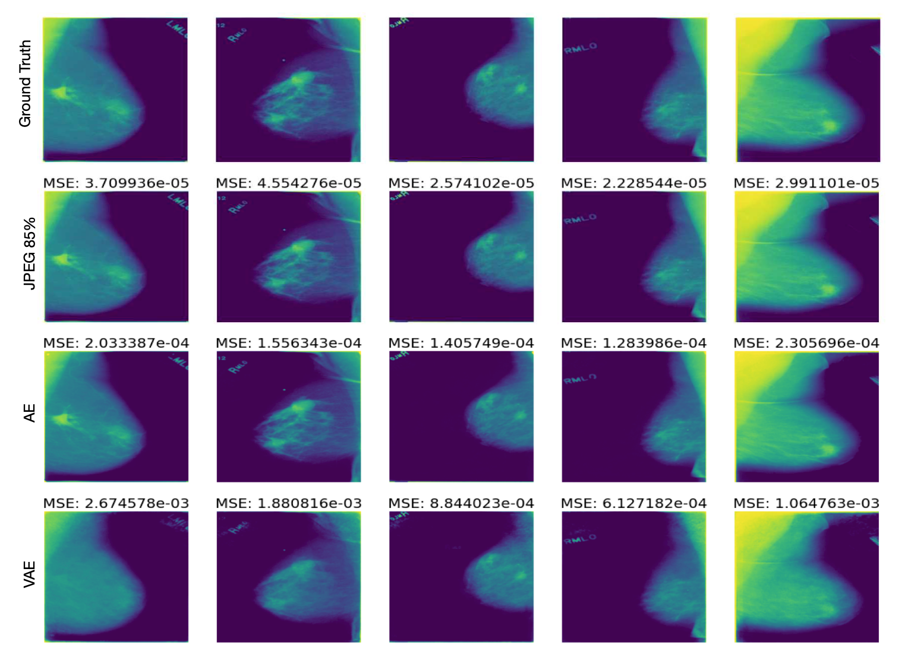

# Image Compression through Representation

## How to use this

### Preprocessing
Use the `preprocessing.ipynb` notebook to preprocess the data first. Make sure you update the .csv file path and the root folder containing the original images.
Once you've rendered the `.h5` files, then make sure to write them to disk for later use with the Deep Learning Models. 

### Training the Models
You can train the models using the notebooks found in the `notebooks` folder. Here, we primarily show how the autoencoder and the variational autoencoder (VAE) work. The models are written with TensorFlow and Keras, and use the preprocessed .h5 file image data for input!

